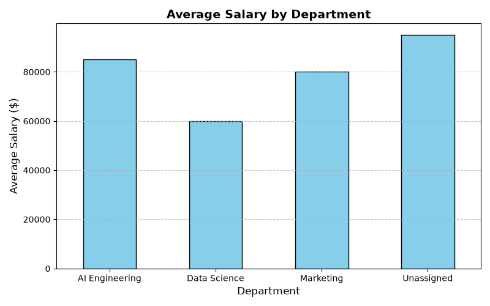

# 📊 Automated Bulk CSV Data Cleaner & Visual Reporter Engine

An automated, production-ready Python data pipeline designed to ingest messy CSV datasets, perform automated data cleaning (de-duplication, missing value imputation), export sanitized datasets, and generate visual summary charts for business management.

---

## 🌟 Key Features

- **Automated De-duplication (`drop_duplicates()`):** Scans multi-column CSV datasets and purges exact duplicate entries while retaining the first unique records.
- **Smart Data Imputation (`fillna()`):** Dynamically replaces missing categorical fields with fallback values and calculates mean averages for missing numerical metrics (`Age`, `Salary`).
- **Data Export Pipeline (`to_csv()`):** Generates clean, ready-to-analyze CSV outputs stripped of artificial index numbers.
- **Visual Report Generation (`Matplotlib`):** Automatically computes aggregated departmental salary metrics and renders high-definition visual bar charts (`PNG`).
- **Clean Dependency Management:** Built with virtual environment isolation and `.gitignore` guardrails to exclude heavy local environments.

---

## 🛠️ Tech Stack

- **Language:** Python 3.12+
- **Data Manipulation:** Pandas
- **Data Visualization:** Matplotlib
- **Version Control:** Git & GitHub

---

## 📁 Repository Structure

```text
csv_data_cleaner/
│
├── cleaner.py                   # Core Python processing & visualization engine
├── raw_data.csv                 # Uncleaned sample dataset input
├── cleaned_data.csv             # Automated sanitized CSV output
├── department_salary_report.png # Generated departmental salary bar chart
├── requirements.txt             # Python project dependencies list
├── .gitignore                   # Excludes virtual environments from git tracking
└── README.md                    # Project documentation & execution manual
```

---

## ⚡ Quick Start Guide

### 1. Clone the Repository
```bash
git clone [https://github.com/bhuttorehman/csv_data_cleaner.git](https://github.com/bhuttorehman/csv_data_cleaner.git)
cd csv_data_cleaner
```

### 2. Set Up Virtual Environment
```bash
# Windows
python -m venv csv_cleaner_env
.\csv_cleaner_env\Scripts\activate

# Mac/Linux
python3 -m venv csv_cleaner_env
source csv_cleaner_env/bin/activate
```

### 3. Install Dependencies
```bash
pip install -r requirements.txt
```

### 4. Run the Data Pipeline
```bash
python cleaner.py
```

---

## 📊 Visual Report Output

The pipeline automatically aggregates department-wise compensation metrics and exports a chart preview:



---

## 👤 Author

**Abdul Rehman**  
*AI Solutions Engineer in Training*

- **GitHub:** [bhuttorehman](https://github.com/bhuttorehman)
- **LinkedIn:** [Abdul Rehman](https://www.linkedin.com/in/bhuttorehman)